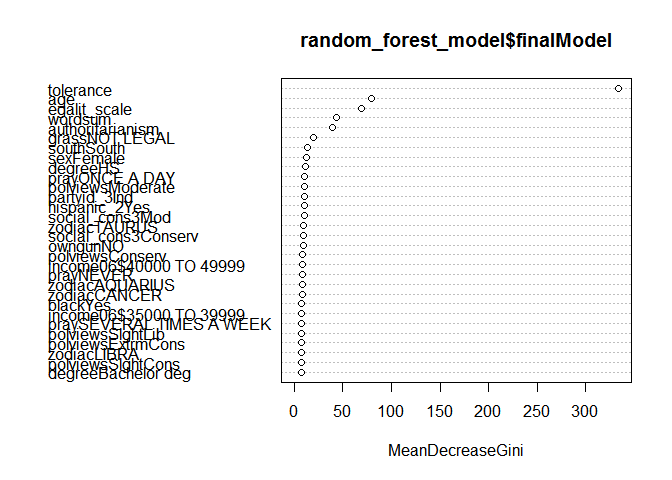

Predicting Attitudes Towards Racist College Professors
================
Gustavo Arruda
2020-11-17

## Load necessary libraries

``` r
library(tidyverse)
library(rcfss)
library(randomForest)
library(knitr)
library(caret)
library(partykit)

theme_set(theme_minimal())

set.seed(1234)
```

``` r
gss_colrac <- gss_colrac

gss_colrac_transformed <- gss_colrac %>%
  mutate(colrac = if_else(colrac == FALSE, "NO",
                           if_else(colrac == TRUE, "YES", NA_character_))) %>%
  mutate_if(is.character, as.factor)

train_control <- trainControl(method = "oob")

# Train the model
random_forest_model <- train(colrac ~., data = gss_colrac_transformed,
                    method = "rf", 
                    ntree = 200,
                    trControl = train_control,
                    na.action = na.omit
                    )

random_forest_model$finalModel
```

    ## 
    ## Call:
    ##  randomForest(x = x, y = y, ntree = 200, mtry = param$mtry) 
    ##                Type of random forest: classification
    ##                      Number of trees: 200
    ## No. of variables tried at each split: 34
    ## 
    ##         OOB estimate of  error rate: 23.56%
    ## Confusion matrix:
    ##      NO YES class.error
    ## NO  850 156   0.1550696
    ## YES 309 659   0.3192149

``` r
varImpPlot(random_forest_model$finalModel)
```

<!-- -->

``` r
colrac_selected <- ctree(colrac ~ tolerance + age + egalit_scale + wordsum + authoritarianism, data = gss_colrac_transformed)

plot(colrac_selected,
     ip_args = list(
       pval = TRUE,
       id = FALSE),
     tp_args = list(
       id = FALSE)
)
```

<!-- -->

I choose a random forest algorithm to build this model. Such algorithm
iteratively select the best variables to construct a forest tree model,
which does a good work to elicit relationships between categorical
variables in a data set. The random\_forest\_model$finalModel chart
shows that ‘tolerance’, ‘age’, ‘egalit\_scale’, ‘wordsum’ and
‘authoritarianism’ are the most important predicting variables.

## Session info

``` r
devtools::session_info()
```

    ## - Session info ---------------------------------------------------------------
    ##  setting  value                       
    ##  version  R version 4.0.2 (2020-06-22)
    ##  os       Windows 8.1 x64             
    ##  system   x86_64, mingw32             
    ##  ui       RTerm                       
    ##  language (EN)                        
    ##  collate  English_United States.1252  
    ##  ctype    English_United States.1252  
    ##  tz       America/Chicago             
    ##  date     2020-11-17                  
    ## 
    ## - Packages -------------------------------------------------------------------
    ##  package      * version    date       lib source                        
    ##  assertthat     0.2.1      2019-03-21 [1] CRAN (R 4.0.2)                
    ##  backports      1.1.10     2020-09-15 [1] CRAN (R 4.0.2)                
    ##  blob           1.2.1      2020-01-20 [1] CRAN (R 4.0.2)                
    ##  broom          0.7.0      2020-07-09 [1] CRAN (R 4.0.2)                
    ##  callr          3.5.1      2020-10-13 [1] CRAN (R 4.0.3)                
    ##  caret        * 6.0-86     2020-03-20 [1] CRAN (R 4.0.3)                
    ##  cellranger     1.1.0      2016-07-27 [1] CRAN (R 4.0.2)                
    ##  class          7.3-17     2020-04-26 [2] CRAN (R 4.0.2)                
    ##  cli            2.0.2      2020-02-28 [1] CRAN (R 4.0.2)                
    ##  codetools      0.2-16     2018-12-24 [2] CRAN (R 4.0.2)                
    ##  colorspace     1.4-1      2019-03-18 [1] CRAN (R 4.0.2)                
    ##  crayon         1.3.4      2017-09-16 [1] CRAN (R 4.0.2)                
    ##  data.table     1.13.2     2020-10-19 [1] CRAN (R 4.0.3)                
    ##  DBI            1.1.0      2019-12-15 [1] CRAN (R 4.0.2)                
    ##  dbplyr         1.4.4      2020-05-27 [1] CRAN (R 4.0.2)                
    ##  desc           1.2.0      2018-05-01 [1] CRAN (R 4.0.2)                
    ##  devtools       2.3.2      2020-09-18 [1] CRAN (R 4.0.3)                
    ##  digest         0.6.25     2020-02-23 [1] CRAN (R 4.0.2)                
    ##  dplyr        * 1.0.2      2020-08-18 [1] CRAN (R 4.0.2)                
    ##  e1071          1.7-4      2020-10-14 [1] CRAN (R 4.0.3)                
    ##  ellipsis       0.3.1      2020-05-15 [1] CRAN (R 4.0.2)                
    ##  evaluate       0.14       2019-05-28 [1] CRAN (R 4.0.2)                
    ##  fansi          0.4.1      2020-01-08 [1] CRAN (R 4.0.2)                
    ##  forcats      * 0.5.0      2020-03-01 [1] CRAN (R 4.0.2)                
    ##  foreach        1.5.1      2020-10-15 [1] CRAN (R 4.0.3)                
    ##  Formula        1.2-4      2020-10-16 [1] CRAN (R 4.0.3)                
    ##  fs             1.5.0      2020-07-31 [1] CRAN (R 4.0.2)                
    ##  generics       0.1.0      2020-10-31 [1] CRAN (R 4.0.3)                
    ##  ggplot2      * 3.3.2      2020-06-19 [1] CRAN (R 4.0.2)                
    ##  glue           1.4.2      2020-08-27 [1] CRAN (R 4.0.2)                
    ##  gower          0.2.2      2020-06-23 [1] CRAN (R 4.0.3)                
    ##  gtable         0.3.0      2019-03-25 [1] CRAN (R 4.0.2)                
    ##  haven          2.3.1      2020-06-01 [1] CRAN (R 4.0.2)                
    ##  hms            0.5.3      2020-01-08 [1] CRAN (R 4.0.2)                
    ##  htmltools      0.5.0      2020-06-16 [1] CRAN (R 4.0.2)                
    ##  httr           1.4.2      2020-07-20 [1] CRAN (R 4.0.2)                
    ##  inum           1.0-1      2019-04-25 [1] CRAN (R 4.0.3)                
    ##  ipred          0.9-9      2019-04-28 [1] CRAN (R 4.0.3)                
    ##  iterators      1.0.13     2020-10-15 [1] CRAN (R 4.0.3)                
    ##  jsonlite       1.7.1      2020-09-07 [1] CRAN (R 4.0.2)                
    ##  knitr        * 1.30       2020-09-22 [1] CRAN (R 4.0.2)                
    ##  lattice      * 0.20-41    2020-04-02 [2] CRAN (R 4.0.2)                
    ##  lava           1.6.8.1    2020-11-04 [1] CRAN (R 4.0.3)                
    ##  libcoin      * 1.0-6      2020-08-14 [1] CRAN (R 4.0.3)                
    ##  lifecycle      0.2.0      2020-03-06 [1] CRAN (R 4.0.2)                
    ##  lubridate      1.7.9      2020-06-08 [1] CRAN (R 4.0.2)                
    ##  magrittr       1.5        2014-11-22 [1] CRAN (R 4.0.2)                
    ##  MASS           7.3-51.6   2020-04-26 [2] CRAN (R 4.0.2)                
    ##  Matrix         1.2-18     2019-11-27 [2] CRAN (R 4.0.2)                
    ##  memoise        1.1.0      2017-04-21 [1] CRAN (R 4.0.2)                
    ##  ModelMetrics   1.2.2.2    2020-03-17 [1] CRAN (R 4.0.3)                
    ##  modelr         0.1.8      2020-05-19 [1] CRAN (R 4.0.2)                
    ##  munsell        0.5.0      2018-06-12 [1] CRAN (R 4.0.2)                
    ##  mvtnorm      * 1.1-1      2020-06-09 [1] CRAN (R 4.0.3)                
    ##  nlme           3.1-148    2020-05-24 [2] CRAN (R 4.0.2)                
    ##  nnet           7.3-14     2020-04-26 [2] CRAN (R 4.0.2)                
    ##  partykit     * 1.2-10     2020-10-12 [1] CRAN (R 4.0.3)                
    ##  pillar         1.4.6      2020-07-10 [1] CRAN (R 4.0.2)                
    ##  pkgbuild       1.1.0      2020-07-13 [1] CRAN (R 4.0.2)                
    ##  pkgconfig      2.0.3      2019-09-22 [1] CRAN (R 4.0.2)                
    ##  pkgload        1.1.0      2020-05-29 [1] CRAN (R 4.0.2)                
    ##  plyr           1.8.6      2020-03-03 [1] CRAN (R 4.0.3)                
    ##  prettyunits    1.1.1      2020-01-24 [1] CRAN (R 4.0.2)                
    ##  pROC           1.16.2     2020-03-19 [1] CRAN (R 4.0.3)                
    ##  processx       3.4.4      2020-09-03 [1] CRAN (R 4.0.2)                
    ##  prodlim        2019.11.13 2019-11-17 [1] CRAN (R 4.0.3)                
    ##  ps             1.3.4      2020-08-11 [1] CRAN (R 4.0.2)                
    ##  purrr        * 0.3.4      2020-04-17 [1] CRAN (R 4.0.2)                
    ##  R6             2.4.1      2019-11-12 [1] CRAN (R 4.0.2)                
    ##  randomForest * 4.6-14     2018-03-25 [1] CRAN (R 4.0.3)                
    ##  rcfss        * 0.2.0      2020-10-09 [1] Github (uc-cfss/rcfss@96a53af)
    ##  Rcpp           1.0.5      2020-07-06 [1] CRAN (R 4.0.2)                
    ##  readr        * 1.3.1      2018-12-21 [1] CRAN (R 4.0.2)                
    ##  readxl         1.3.1      2019-03-13 [1] CRAN (R 4.0.2)                
    ##  recipes        0.1.15     2020-11-11 [1] CRAN (R 4.0.3)                
    ##  remotes        2.2.0      2020-07-21 [1] CRAN (R 4.0.2)                
    ##  reprex         0.3.0      2019-05-16 [1] CRAN (R 4.0.2)                
    ##  reshape2       1.4.4      2020-04-09 [1] CRAN (R 4.0.3)                
    ##  rlang          0.4.7      2020-07-09 [1] CRAN (R 4.0.2)                
    ##  rmarkdown      2.5        2020-10-21 [1] CRAN (R 4.0.3)                
    ##  rpart          4.1-15     2019-04-12 [2] CRAN (R 4.0.2)                
    ##  rprojroot      1.3-2      2018-01-03 [1] CRAN (R 4.0.2)                
    ##  rstudioapi     0.11       2020-02-07 [1] CRAN (R 4.0.2)                
    ##  rvest          0.3.6      2020-07-25 [1] CRAN (R 4.0.2)                
    ##  scales         1.1.1      2020-05-11 [1] CRAN (R 4.0.2)                
    ##  sessioninfo    1.1.1      2018-11-05 [1] CRAN (R 4.0.2)                
    ##  stringi        1.5.3      2020-09-09 [1] CRAN (R 4.0.2)                
    ##  stringr      * 1.4.0      2019-02-10 [1] CRAN (R 4.0.2)                
    ##  survival       3.1-12     2020-04-10 [2] CRAN (R 4.0.2)                
    ##  testthat       2.3.2      2020-03-02 [1] CRAN (R 4.0.2)                
    ##  tibble       * 3.0.3      2020-07-10 [1] CRAN (R 4.0.2)                
    ##  tidyr        * 1.1.2      2020-08-27 [1] CRAN (R 4.0.2)                
    ##  tidyselect     1.1.0      2020-05-11 [1] CRAN (R 4.0.2)                
    ##  tidyverse    * 1.3.0      2019-11-21 [1] CRAN (R 4.0.2)                
    ##  timeDate       3043.102   2018-02-21 [1] CRAN (R 4.0.3)                
    ##  usethis        1.6.3      2020-09-17 [1] CRAN (R 4.0.2)                
    ##  vctrs          0.3.4      2020-08-29 [1] CRAN (R 4.0.2)                
    ##  withr          2.3.0      2020-09-22 [1] CRAN (R 4.0.2)                
    ##  xfun           0.17       2020-09-09 [1] CRAN (R 4.0.2)                
    ##  xml2           1.3.2      2020-04-23 [1] CRAN (R 4.0.2)                
    ##  yaml           2.2.1      2020-02-01 [1] CRAN (R 4.0.3)                
    ## 
    ## [1] C:/Users/Gustavo/OneDrive - The University of Chicago/Documents/R/win-library/4.0
    ## [2] C:/Program Files/R/R-4.0.2/library
