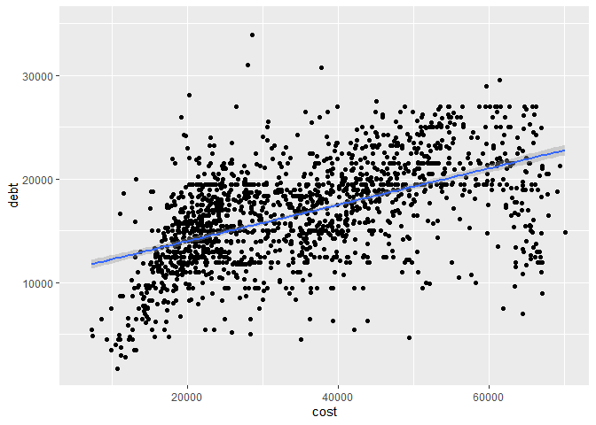
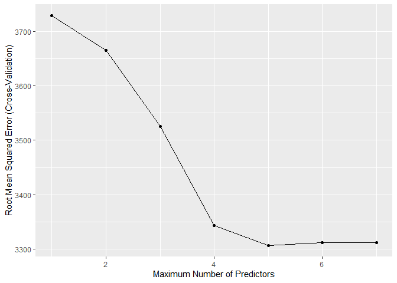

Predicting student debt load
================
Gustavo Arruda
2020-11-17

## Load necessary libraries

``` r
library(tidyverse)
library(rcfss)
library(leaps)
library(caret)
library(ggplot2)
library(knitr)
library(broom)
set.seed(1234)
```

## Single Variable Model

``` r
ggplot(scorecard, aes(cost, debt)) +
  geom_point() +
  geom_smooth(method = "lm")
```

<!-- -->

## Multiple Variables Model

``` r
scorecard_num <- select(scorecard, admrate:debt)
#Limiting the model to numerical variables.

# Source of help:
#http://www.sthda.com/english/articles/37-model-selection-essentials-in-r/154-stepwise-regression-essentials-in-r/

# Set up repeated k-fold cross-validation
train_control <- trainControl(method = "cv", number = 10)

# Train the model
back_selection <- train(debt ~., data = scorecard_num,
                    method = "leapBackward", 
                    tuneGrid = data.frame(nvmax = 1:7),
                    trControl = train_control,
                    na.action = na.omit
                    )

ggplot(back_selection) +
  labs(y = "Root Mean Squared Error (Cross-Validation)")
```

<!-- -->

``` r
summary(back_selection$finalModel)
```

    ## Subset selection object
    ## 7 Variables  (and intercept)
    ##           Forced in Forced out
    ## admrate       FALSE      FALSE
    ## satavg        FALSE      FALSE
    ## cost          FALSE      FALSE
    ## avgfacsal     FALSE      FALSE
    ## pctpell       FALSE      FALSE
    ## comprate      FALSE      FALSE
    ## firstgen      FALSE      FALSE
    ## 1 subsets of each size up to 5
    ## Selection Algorithm: backward
    ##          admrate satavg cost avgfacsal pctpell comprate firstgen
    ## 1  ( 1 ) " "     " "    "*"  " "       " "     " "      " "     
    ## 2  ( 1 ) " "     " "    "*"  " "       " "     "*"      " "     
    ## 3  ( 1 ) " "     "*"    "*"  " "       " "     "*"      " "     
    ## 4  ( 1 ) " "     "*"    "*"  " "       " "     "*"      "*"     
    ## 5  ( 1 ) "*"     "*"    "*"  " "       " "     "*"      "*"

``` r
scorecard_model <- lm(debt ~ admrate + satavg + cost + comprate + firstgen, data = scorecard) %>%
  tidy()
kable(scorecard_model)
```

| term        |       estimate |    std.error |   statistic | p.value |
| :---------- | -------------: | -----------: | ----------: | ------: |
| (Intercept) |   2.535559e+04 | 1675.3265963 |   15.134714 |   0e+00 |
| admrate     |   3.054939e+03 |  559.8360411 |    5.456847 |   1e-07 |
| satavg      | \-1.577738e+01 |    1.3788018 | \-11.442819 |   0e+00 |
| cost        |   1.225681e-01 |    0.0084482 |   14.508133 |   0e+00 |
| comprate    |   1.106673e+04 | 1003.2377916 |   11.031015 |   0e+00 |
| firstgen    | \-1.327550e+04 | 1433.0682752 |  \-9.263691 |   0e+00 |

I used a backward variable selection algorithm to decide which variables
to use in my multivariate linear model. In those kinds of algorithms we
start using all variables, then iteratively test models by removing each
variable at a time until the change is statistically significant. The
issue with variable selection algorithms is that models might get
overfitted to the training data set and perform significantly worse with
subsequent testing data. To avoid overfitting I used a k-fold
cross-validation algorithm. That method iteratively trains models with a
random fraction of the data then tests them with the remaining data.

The RMSE \~ Maximum Number of Predictors chart shows that the models
with the least error given my parameters were the ones with 5 predictor
variables. Under further examination, the model indicates that the best
predictor variables are admrate, satavg, cost, comprate and firstgen. I
included a table calculating their coefficients and standard error.

The best predicting variable does seem to be cost followed by satavg,
with relatively much lower standard errors. The costlier the cost of
attendance, the highest the median student debt, which is somewhat
self-explanatory. The average SAT admission score coefficient is more
puzzling to me. The highest the SAT score, the lowest the student debt.
My hunch here is that there is a confounding variable: the average
social standing of the student body directly influences their ability to
prepare for the SATs. Hence, a higher average SAT score would mean less
need to take on debt. Following those in the order of increasing
standard error, admissions rates have a comparatively higher positive
coefficient with student debt. In this case, for profit colleges come to
mind: the easiest it is to get into a college, the larger the
probability of that given college being for profit which would lead to
higher student debt. Subsequentially, completion rates have a positive
coefficient and proportion of first generation student body have a
negative coefficient with student debt, although they both have much
higher standard error. Again, lower proportion of first generation
students might have the confounding variable of average social standing
of the student body with median student debt.

## Session info

``` r
devtools::session_info()
```

    ## - Session info ---------------------------------------------------------------
    ##  setting  value                       
    ##  version  R version 4.0.2 (2020-06-22)
    ##  os       Windows 8.1 x64             
    ##  system   x86_64, mingw32             
    ##  ui       RTerm                       
    ##  language (EN)                        
    ##  collate  English_United States.1252  
    ##  ctype    English_United States.1252  
    ##  tz       America/Chicago             
    ##  date     2020-11-17                  
    ## 
    ## - Packages -------------------------------------------------------------------
    ##  package      * version    date       lib source                        
    ##  assertthat     0.2.1      2019-03-21 [1] CRAN (R 4.0.2)                
    ##  backports      1.1.10     2020-09-15 [1] CRAN (R 4.0.2)                
    ##  blob           1.2.1      2020-01-20 [1] CRAN (R 4.0.2)                
    ##  broom        * 0.7.0      2020-07-09 [1] CRAN (R 4.0.2)                
    ##  callr          3.5.1      2020-10-13 [1] CRAN (R 4.0.3)                
    ##  caret        * 6.0-86     2020-03-20 [1] CRAN (R 4.0.3)                
    ##  cellranger     1.1.0      2016-07-27 [1] CRAN (R 4.0.2)                
    ##  class          7.3-17     2020-04-26 [2] CRAN (R 4.0.2)                
    ##  cli            2.0.2      2020-02-28 [1] CRAN (R 4.0.2)                
    ##  codetools      0.2-16     2018-12-24 [2] CRAN (R 4.0.2)                
    ##  colorspace     1.4-1      2019-03-18 [1] CRAN (R 4.0.2)                
    ##  crayon         1.3.4      2017-09-16 [1] CRAN (R 4.0.2)                
    ##  data.table     1.13.2     2020-10-19 [1] CRAN (R 4.0.3)                
    ##  DBI            1.1.0      2019-12-15 [1] CRAN (R 4.0.2)                
    ##  dbplyr         1.4.4      2020-05-27 [1] CRAN (R 4.0.2)                
    ##  desc           1.2.0      2018-05-01 [1] CRAN (R 4.0.2)                
    ##  devtools       2.3.2      2020-09-18 [1] CRAN (R 4.0.3)                
    ##  digest         0.6.25     2020-02-23 [1] CRAN (R 4.0.2)                
    ##  dplyr        * 1.0.2      2020-08-18 [1] CRAN (R 4.0.2)                
    ##  ellipsis       0.3.1      2020-05-15 [1] CRAN (R 4.0.2)                
    ##  evaluate       0.14       2019-05-28 [1] CRAN (R 4.0.2)                
    ##  fansi          0.4.1      2020-01-08 [1] CRAN (R 4.0.2)                
    ##  farver         2.0.3      2020-01-16 [1] CRAN (R 4.0.2)                
    ##  forcats      * 0.5.0      2020-03-01 [1] CRAN (R 4.0.2)                
    ##  foreach        1.5.1      2020-10-15 [1] CRAN (R 4.0.3)                
    ##  fs             1.5.0      2020-07-31 [1] CRAN (R 4.0.2)                
    ##  generics       0.1.0      2020-10-31 [1] CRAN (R 4.0.3)                
    ##  ggplot2      * 3.3.2      2020-06-19 [1] CRAN (R 4.0.2)                
    ##  glue           1.4.2      2020-08-27 [1] CRAN (R 4.0.2)                
    ##  gower          0.2.2      2020-06-23 [1] CRAN (R 4.0.3)                
    ##  gtable         0.3.0      2019-03-25 [1] CRAN (R 4.0.2)                
    ##  haven          2.3.1      2020-06-01 [1] CRAN (R 4.0.2)                
    ##  highr          0.8        2019-03-20 [1] CRAN (R 4.0.2)                
    ##  hms            0.5.3      2020-01-08 [1] CRAN (R 4.0.2)                
    ##  htmltools      0.5.0      2020-06-16 [1] CRAN (R 4.0.2)                
    ##  httr           1.4.2      2020-07-20 [1] CRAN (R 4.0.2)                
    ##  ipred          0.9-9      2019-04-28 [1] CRAN (R 4.0.3)                
    ##  iterators      1.0.13     2020-10-15 [1] CRAN (R 4.0.3)                
    ##  jsonlite       1.7.1      2020-09-07 [1] CRAN (R 4.0.2)                
    ##  knitr        * 1.30       2020-09-22 [1] CRAN (R 4.0.2)                
    ##  labeling       0.3        2014-08-23 [1] CRAN (R 4.0.0)                
    ##  lattice      * 0.20-41    2020-04-02 [2] CRAN (R 4.0.2)                
    ##  lava           1.6.8.1    2020-11-04 [1] CRAN (R 4.0.3)                
    ##  leaps        * 3.1        2020-01-16 [1] CRAN (R 4.0.3)                
    ##  lifecycle      0.2.0      2020-03-06 [1] CRAN (R 4.0.2)                
    ##  lubridate      1.7.9      2020-06-08 [1] CRAN (R 4.0.2)                
    ##  magrittr       1.5        2014-11-22 [1] CRAN (R 4.0.2)                
    ##  MASS           7.3-51.6   2020-04-26 [2] CRAN (R 4.0.2)                
    ##  Matrix         1.2-18     2019-11-27 [2] CRAN (R 4.0.2)                
    ##  memoise        1.1.0      2017-04-21 [1] CRAN (R 4.0.2)                
    ##  mgcv           1.8-31     2019-11-09 [2] CRAN (R 4.0.2)                
    ##  ModelMetrics   1.2.2.2    2020-03-17 [1] CRAN (R 4.0.3)                
    ##  modelr         0.1.8      2020-05-19 [1] CRAN (R 4.0.2)                
    ##  munsell        0.5.0      2018-06-12 [1] CRAN (R 4.0.2)                
    ##  nlme           3.1-148    2020-05-24 [2] CRAN (R 4.0.2)                
    ##  nnet           7.3-14     2020-04-26 [2] CRAN (R 4.0.2)                
    ##  pillar         1.4.6      2020-07-10 [1] CRAN (R 4.0.2)                
    ##  pkgbuild       1.1.0      2020-07-13 [1] CRAN (R 4.0.2)                
    ##  pkgconfig      2.0.3      2019-09-22 [1] CRAN (R 4.0.2)                
    ##  pkgload        1.1.0      2020-05-29 [1] CRAN (R 4.0.2)                
    ##  plyr           1.8.6      2020-03-03 [1] CRAN (R 4.0.3)                
    ##  prettyunits    1.1.1      2020-01-24 [1] CRAN (R 4.0.2)                
    ##  pROC           1.16.2     2020-03-19 [1] CRAN (R 4.0.3)                
    ##  processx       3.4.4      2020-09-03 [1] CRAN (R 4.0.2)                
    ##  prodlim        2019.11.13 2019-11-17 [1] CRAN (R 4.0.3)                
    ##  ps             1.3.4      2020-08-11 [1] CRAN (R 4.0.2)                
    ##  purrr        * 0.3.4      2020-04-17 [1] CRAN (R 4.0.2)                
    ##  R6             2.4.1      2019-11-12 [1] CRAN (R 4.0.2)                
    ##  rcfss        * 0.2.0      2020-10-09 [1] Github (uc-cfss/rcfss@96a53af)
    ##  Rcpp           1.0.5      2020-07-06 [1] CRAN (R 4.0.2)                
    ##  readr        * 1.3.1      2018-12-21 [1] CRAN (R 4.0.2)                
    ##  readxl         1.3.1      2019-03-13 [1] CRAN (R 4.0.2)                
    ##  recipes        0.1.15     2020-11-11 [1] CRAN (R 4.0.3)                
    ##  remotes        2.2.0      2020-07-21 [1] CRAN (R 4.0.2)                
    ##  reprex         0.3.0      2019-05-16 [1] CRAN (R 4.0.2)                
    ##  reshape2       1.4.4      2020-04-09 [1] CRAN (R 4.0.3)                
    ##  rlang          0.4.7      2020-07-09 [1] CRAN (R 4.0.2)                
    ##  rmarkdown      2.5        2020-10-21 [1] CRAN (R 4.0.3)                
    ##  rpart          4.1-15     2019-04-12 [2] CRAN (R 4.0.2)                
    ##  rprojroot      1.3-2      2018-01-03 [1] CRAN (R 4.0.2)                
    ##  rstudioapi     0.11       2020-02-07 [1] CRAN (R 4.0.2)                
    ##  rvest          0.3.6      2020-07-25 [1] CRAN (R 4.0.2)                
    ##  scales         1.1.1      2020-05-11 [1] CRAN (R 4.0.2)                
    ##  sessioninfo    1.1.1      2018-11-05 [1] CRAN (R 4.0.2)                
    ##  stringi        1.5.3      2020-09-09 [1] CRAN (R 4.0.2)                
    ##  stringr      * 1.4.0      2019-02-10 [1] CRAN (R 4.0.2)                
    ##  survival       3.1-12     2020-04-10 [2] CRAN (R 4.0.2)                
    ##  testthat       2.3.2      2020-03-02 [1] CRAN (R 4.0.2)                
    ##  tibble       * 3.0.3      2020-07-10 [1] CRAN (R 4.0.2)                
    ##  tidyr        * 1.1.2      2020-08-27 [1] CRAN (R 4.0.2)                
    ##  tidyselect     1.1.0      2020-05-11 [1] CRAN (R 4.0.2)                
    ##  tidyverse    * 1.3.0      2019-11-21 [1] CRAN (R 4.0.2)                
    ##  timeDate       3043.102   2018-02-21 [1] CRAN (R 4.0.3)                
    ##  usethis        1.6.3      2020-09-17 [1] CRAN (R 4.0.2)                
    ##  vctrs          0.3.4      2020-08-29 [1] CRAN (R 4.0.2)                
    ##  withr          2.3.0      2020-09-22 [1] CRAN (R 4.0.2)                
    ##  xfun           0.17       2020-09-09 [1] CRAN (R 4.0.2)                
    ##  xml2           1.3.2      2020-04-23 [1] CRAN (R 4.0.2)                
    ##  yaml           2.2.1      2020-02-01 [1] CRAN (R 4.0.3)                
    ## 
    ## [1] C:/Users/Gustavo/OneDrive - The University of Chicago/Documents/R/win-library/4.0
    ## [2] C:/Program Files/R/R-4.0.2/library
